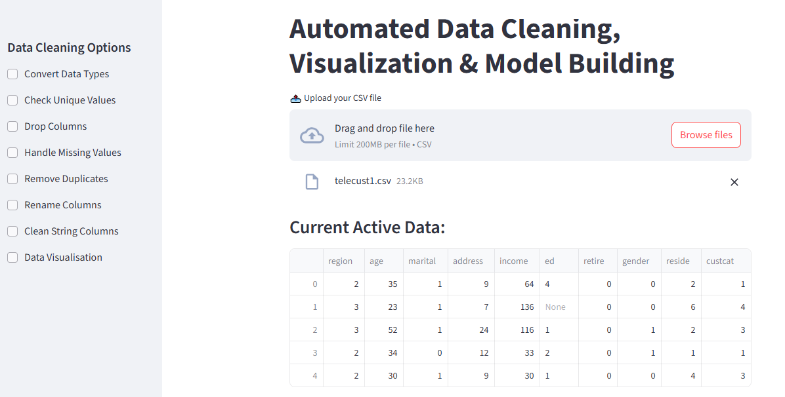
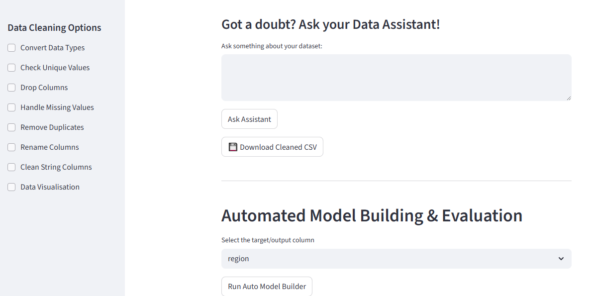

# Automated EDA, Data Cleaning & Visualization Pipeline with Integrated Chatbot (Python + Streamlit)
<p align="center">
  
</p>

### Turn Any CSV/Excel File into Insights, Charts, Reports & Machine Learning Models — **No Code Required**

This repository contains a powerful, production ready **Streamlit web application** that combines:

- Automated Exploratory Data Analysis (EDA)  
- Intelligent Data Cleaning  
-  One Click Interactive Visualizations  
- AI-Powered Data Assistant (Chat with your dataset using DeepSeek LLM)  
- Fully Automated Machine Learning (Classification + Regression)  
- Export Cleaned Data & Charts directly to Excel  

All inside a clean, intuitive browser interface  perfect for **business analysts, data scientists, students, and non technical users**.

---

## 📸 Screenshots

### Main Dashboard


### Data Assistant & ML Workflow


---

##  Project Description

The project is designed as an end to end data intelligence pipeline.  
It eliminates the repetitive and time consuming tasks typically found in data analysis by automating:

- Data cleaning (missing values, duplicates, encodings, scaling, normalization)
- Visualization (bar charts, line charts, heatmaps, treemaps, histograms, scatter plots, pie charts, and more)
- Dataset insight generation through an integrated AI chatbot powered by **DeepSeek** (HuggingFace API)
- Automated ML model selection and training for **classification** and **regression**
- Downloading cleaned datasets (CSV/Excel)
- Exporting plotted charts directly into Excel files

All these operations are controlled through the Streamlit UI, making the entire workflow accessible with minimal effort.

---

##  Repository Structure
```
.
├── data_assistant.py        
├── data_cleaning.py         
├── data_visualisation.py    
├── modelbuilding.py         
├── interface.py             
├── ss.png                   
├── ss1.png                  
├── requirements.txt
└── README.md                
```

---
### Project Files

| File                    | Purpose                                                                 |
|-------------------------|-------------------------------------------------------------------------|
| `interface.py`          | Main Streamlit app — the only file you need to run                      |
| `data_assistant.py`     | AI chatbot using **DeepSeek** via Hugging Face Inference API            |
| `data_cleaning.py`      | All automated cleaning logic (imputation, encoding, outlier removal)    |
| `data_visualisation.py` | 30+ validated chart functions with smart type detection                 |
| `modelbuilding.py`      | Full AutoML pipeline with preprocessing, multiple algorithms & evaluation|
| `requirements.txt`      | All required packages                                                   |
| `.env.example`          | Template for your Hugging Face API key                                  |

##  AI Data Assistant (DeepSeek via HuggingFace)

The file **data_assistant.py** connects to HuggingFace’s Inference API using the `InferenceClient` class.  
It uses the DeepSeek model to generate insights from any uploaded dataset.

Examples of questions users can ask:

- “Give a summary of the dataset.”
- “Which columns influence the target variable the most?”
- “Show missing value insights.”
- “Explain trends or anomalies in simple terms.”

You must provide your own HuggingFace API key in the `.env` file:

This ensures full privacy and control.

---

##  Automated Data Cleaning Engine

The file **data_cleaning.py** performs full preprocessing:

- Missing value imputation  
- Removal of duplicates  
- Correction of data types  
- Encoding of categorical variables (Ordinal & One-Hot)  
- Scaling and normalization using `StandardScaler`  
- Automatic detection of column types  
- Final cleaned dataset available for download (CSV or Excel)

---

##  One Click Visualization Engine

The file **data_visualisation.py** generates all major plot types:

- Line plots  
- Scatter plots  
- Bar and Grouped Bar charts  
- Histogram & KDE plots  
- Boxplots, Violin plots  
- Heatmaps  
- Treemaps using `squarify`  
- Donut & Pie charts  
- Area plots  

Internally it uses:

- `matplotlib.pyplot`
- `seaborn`
- `numpy`
- `pandas`
- `squarify`

All charts can be exported and embedded into Excel files through the UI.

---

##  Automated Machine Learning Pipeline

The file **modelbuilding.py** is a fully functioning AutoML engine.  
It automatically detects the task type based on the target variable:

- **Classification**
- **Regression**

It uses:

- `Pipeline`, `ColumnTransformer`
- `SimpleImputer`, `StandardScaler`, `OneHotEncoder`, `OrdinalEncoder`
- `train_test_split`
- Metrics such as:
  - Accuracy, F1, Precision, Recall
  - RMSE, MAE, R²
  - ROC-AUC

The result page includes:

- Model metrics  
- Predictions  
- Error summaries  
- Best model selection  

---

##  Streamlit User Interface

The file **interface.py** connects all modules into a single interactive workflow.  
Features include:

- File uploader (CSV/Excel)
- Data preview
- just few click cleaning
- AI chatbot panel
- Visualization dashboard
- Automated ML module
- Download buttons for cleaned data & Excel with charts

No coding is required from the user.

---

##  Libraries Used

### Data Handling
- `pandas` – tabular data manipulation  
- `numpy` – numerical computation  

### Visualization
- `matplotlib.pyplot` – base plotting  
- `seaborn` – statistical visualization  
- `squarify` – treemaps  

### Machine Learning
- `scikit-learn`:
  - `Pipeline`, `ColumnTransformer`
  - `SimpleImputer`, `StandardScaler`, `OneHotEncoder`, `OrdinalEncoder`
  - `train_test_split`, `KFold`, `StratifiedKFold`
  - Evaluation metrics (`accuracy_score`, `f1_score`, `mean_squared_error`, etc.)

### AI Assistant
- `huggingface_hub.InferenceClient` – DeepSeek model inference  
- `dotenv` – load API keys securely  
- `os` – environment variable handling  
 

---

##  Installation & Setup

### 1. Clone the Repository

``` git clone https://github.com/yourusername/Automated-EDA-Data-Cleaning-Visualization-Pipeline-With-integrated-Chatbot-using-PythonStreamlit.```


### 2. Install Required Libraries
``` pip install -r requirements.txt```

### 3. Add Your HuggingFace API Key
Create a .env file in the project root:

``` HUGGINGFACE_API_KEY=your_key_here```
### 4. Run the Streamlit App

``` streamlit run interface ```

---
##  Future Scope

The next major feature planned for this system is:

### Automated PPT Generation

- An open source PPT creation API will be integrated.
- Users will be able to upload any dataset, and the system will automatically:
  - Generate insights
  - Create charts
  - Build slides
  - Export a complete PowerPoint presentation

  This will transform the tool into a fully automated **data to report engine**.
---
## 🤝 Contributions

Contributions, feature additions, and improvements are always welcome!  

We appreciate your support in making this project better! 


